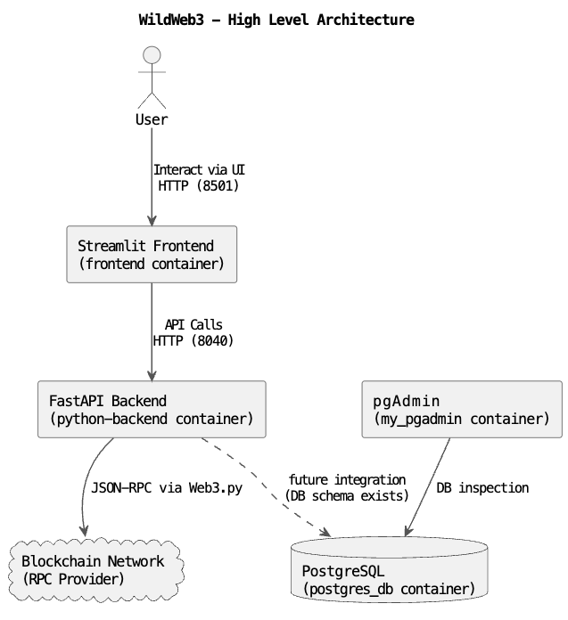

# WildWeb3

WildWeb3 began as my place to figure out how all the moving parts of Web3 fit together: smart contracts, compilation, deployment, Python tooling, frontends, API design, and Docker.

The goal was to understand the full development loop, try some things out and have examples to refer back to later. 


## What’s Inside?

### Smart Contract Side
- Solidity examples, starting with Inbox.sol
- Contract compilation with solcx
- Deployment via Web3.py
- ABI + metadata management

### Backend (Python)
- REST API using FastAPI
- Structured route organisation (routes_*)
- Account handling & signing
- Configuration using TOML
- Python/Pydantic models for request/response handling
- Contract interaction through wrapper classes
- Dockerised development setup

The Docker environment includes PostgreSQL and pgAdmin, intended for future persistence of contract metadata and event logs. At present the backend is stateless, but the groundwork is in place for expansion.


### Frontend
- Streamlit - simple interactive UI

### Database Layer (PostgreSQL + pgAdmin)

The Docker environment includes a PostgreSQL database and a pgAdmin instance for inspecting tables and running queries.
pgAdmin is available at:

`http://localhost:5050`
(default login is set in docker-compose.yml)

An initial schema exists in db/init.sql for tracking deployed contracts, function calls, and emitted events.
The backend doesn’t use the database yet — the schema and services are in place for when persistence becomes useful.


## Quick Start

1. **Setup Environment Variables**:
   - Follow the [Setup Instructions](docs/setup.md) to create the necessary configuration files and environment variables.

2. **Build and Run with Docker Compose**:
   - Navigate to the project root directory.
   - Run the following command to build and start the services:
     ```sh
     docker-compose up --build
     ```

3. **Access the Frontend**:
    - Open your web browser and navigate to `http://localhost:8501`

## Documentation

- [Setup Instructions](docs/setup.md)
- [Frontend](docs/frontend.md)
- [Python Backend](docs/python_backend.md)


## Architecture Overview

WildWeb3 uses a simple end-to-end design with a Streamlit UI, FastAPI backend, and Web3.py connector.



More detailed backend documentation and component diagrams are available in  
[`docs/python_backend.md`](docs/python_backend.md).


## Future Work / WIP

- **Integrating the database layer**
Fully integrate the database layer into the backend.

- **Adding more contract examples**
ERC20, ERC721, more complex multi-method workflows, gas-measurement experiments, etc.

- **Improving the UI**
Either a richer Streamlit interface or a small React/Svelte panel talking to the FastAPI backend.

- **Expanding tests**
Deployment flows, error paths, contract interaction scenarios.

- **Typed contract wrappers**
Generating or hand-crafting strongly typed Python wrappers around common Solidity contract interfaces.

- **Better error-handling and logging**
More structured logs, clearer error boundaries, and improved UX for debugging.

- **Exploring Rust tooling**
For contract compilation, signing, or backend services as a performance exploration.

- **Adding CI**
Linting, type checks, test runs, documentation checks

- **Updating to Pydantic v2**
Use Pydantic v2-style models, validation, etc.
